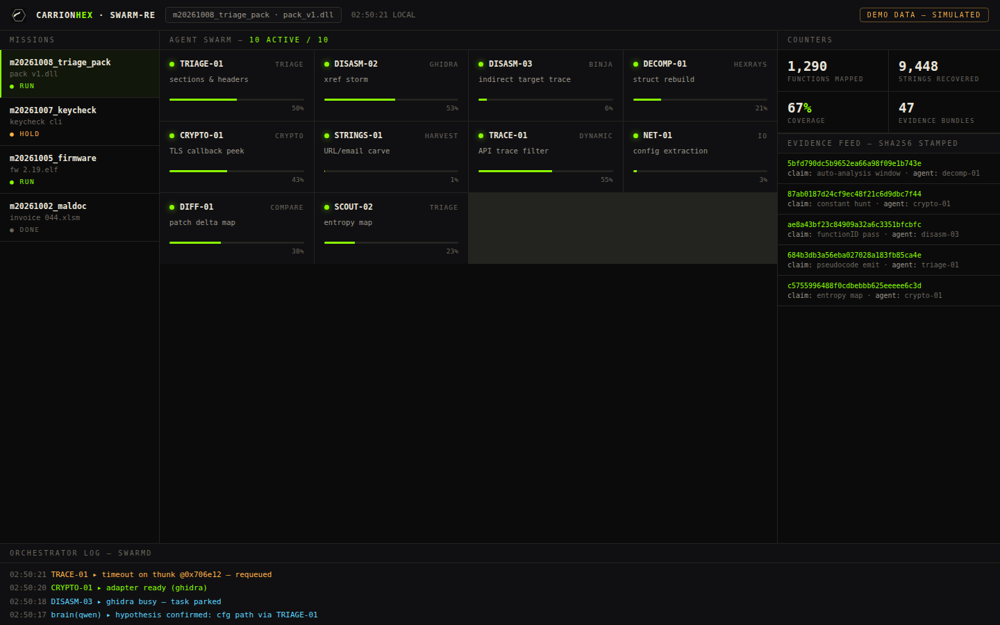

# SWARM-RE

> **AI-swarm-driven reverse engineering pipeline. Fully local. Evidence-bundled.**

SWARM-RE turns a queue of reverse-engineering missions into coordinated multi-agent campaigns. Local LLM brains triage, deep-analysis engines decompile, and every conclusion lands in a sha256-stamped evidence bundle you can replay, diff, and audit.

Manual RE doesn't scale. Campaigns do.



---

## What it does

- **Mission queue** — drop targets in, the swarm plans and executes the campaign
- **Multi-agent rooms** — specialized agents work in parallel, cross-check each other, merge findings
- **Local brain dispatch** — runs against your own Ollama models. No data leaves the box.
- **Deep-analysis adapters** — plug in Ghidra, Hopper, or your own IDA Pro installation (BYO license)
- **Recall layer** — every finding is indexed; the swarm remembers what it already cracked, so it never re-solves the same gate twice
- **Evidence bundles** — sha256-stamped, replayable, diffable. Conclusions you can defend.
- **War-room TUI** — live terminal view of rooms, missions, and agent chatter

## Architecture

```
                ┌─────────────────────────────┐
 Agent surfaces │   CLI · TUI · MCP bridge    │
                └──────────────┬──────────────┘
                               │
                ┌──────────────▼──────────────┐
 Orchestrator   │  Mission queue · Room mgr   │
                │  Brain dispatch · Keepalive │
                └───────┬──────────────┬──────┘
                        │              │
          ┌─────────────▼──┐   ┌───────▼──────────┐
 Brains   │  Local LLMs    │   │  Recall index    │
          │  (Ollama)      │   │  (searchable)    │
          └─────────────┬──┘   └──────────────────┘
                        │
          ┌─────────────▼──────────────────────────┐
 Engines  │  Ghidra · Hopper · BYO IDA · JADX ·    │
          │  Binwalk/Unblob · browser · capture    │
          └─────────────┬──────────────────────────┘
                        │
          ┌─────────────▼──────────────────────────┐
 Evidence │  sha256-stamped bundles · diffs        │
          └────────────────────────────────────────┘
```

Everything runs on your hardware. One ordinary server with a GPU (or even without) is enough.

## Quickstart

```bash
# 1. Clone
git clone https://github.com/carrionhex/swarm-re && cd swarm-re

# 2. Install
./install.sh          # checks deps, sets up dirs

# 3. Point at your local brain
export OLLAMA_HOST=http://127.0.0.1:11434

# 4. Launch the war room
swarm-re tui
```

Then drop a target into the queue and watch the campaign run:

```bash
swarm-re mission add ./targets/crackme01.exe --profile native
```

**Bring your own licensed tools.** SWARM-RE ships no commercial software. Adapters connect to tools you already own and license yourself.

## Tiers

| | **Community** | **Lab** |
|---|---|---|
| Orchestrator, rooms, TUI | ✅ | ✅ |
| Recall layer | ✅ | ✅ |
| Adapter count | core set | full set |
| Multi-agent campaigns | — | ✅ |
| Heavy formats (packed/VM/firmware campaigns) | — | ✅ |
| Priority support | — | ✅ |
| Price | Free / low-cost license | Site license — contact us |

*Community tier is activated with a license key — free keys for students and researchers.*

## Responsible use

SWARM-RE is built for **authorized testing**: your software, your binaries, your scope. Breaking down a target you own or are contracted to assess is the entire point. Anything else is on you — see [EULA](EULA.md).

## License

Business Source License 1.1 — free to use, modify, and redistribute; competing hosted/managed offerings are not permitted. Converts to Apache-2.0 on the change date. The SWARM-RE name and marks are trademarks of the project. See [LICENSE](LICENSE).

## Specification

Behavior contract the implementation is tested against: [docs/SPEC.md](docs/SPEC.md).

## Status

Actively developed. Roadmap and issue tracker are the source of truth. Contributions welcome — see [CONTRIBUTING](CONTRIBUTING.md).

---

*Built by reverse engineers, for reverse engineers.*
